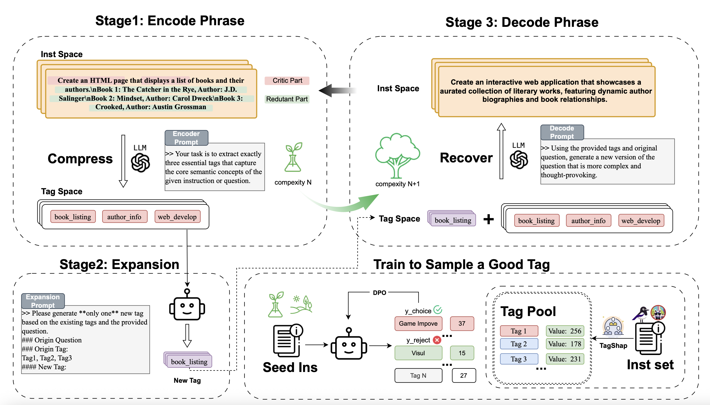
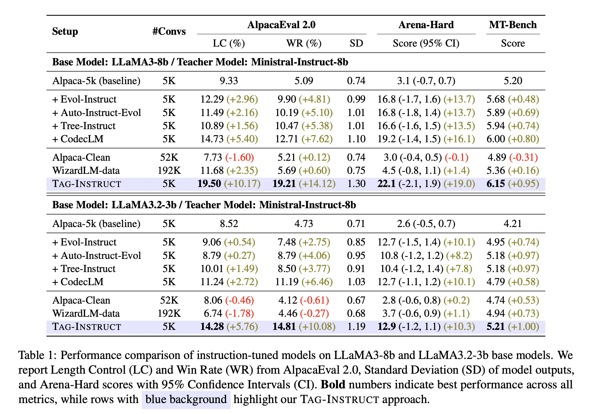

# 🏷️ Tag-Instruct: Controlled Instruction Complexity Enhancement through Structure-based Augmentation


[](tag_instruct_acl25_arixv.pdf) [](https://opensource.org/licenses/MIT) [](https://huggingface.co/collections/username/tag-instruct) [](chttps://modelscope.cn/models/chichi56/llama3-8b-tag_instruct_reward_4)


## 📰 News
- [2025/02/15] Tag-Instruct paper is submitted to ACL 2025!
- [2025/05/08] Our paper and models are now publicly available on [arXiv](https://arxiv.org/abs/2505.18557) and [ModelScope](https://modelscope.cn/models/chichi56/llama3-8b-tag_instruct_reward_4).
- [2025/07/27] Tag-Instruct paper is accepted to ACL 2025 Findings!


## 📋 Overview

**Tag-Instruct** is a novel framework that enhances instruction complexity through structured semantic compression and controlled difficulty augmentation. Unlike previous prompt-based methods operating on raw text, Tag-Instruct compresses instructions into a compact tag space and systematically enhances complexity through RL-guided tag expansion.

Our approach outperforms existing instruction complexity augmentation techniques and provides superior controllability and stability across different instruction synthesis frameworks.

## 🔍 Key Innovations

Tag-Instruct introduces several key innovations:

1. **Semantic Compression**: Compresses instructions into a compact tag representation while preserving task-relevant information
2. **RL-based Tag Expansion**: Explores the tag space to discover new semantic tags that meaningfully increase complexity
3. **Principled Tag Utility Estimation**: Uses Shapley values to quantify tag utility through marginal contributions
4. **Iterative Enhancement Process**: Enables progressive difficulty increases while maintaining semantic coherence

## 🧠 Motivation

High-quality instruction data is crucial for large language models (LLMs), yet existing approaches struggle to effectively control instruction complexity. The quality of synthesized data correlates to correctness, diversity, and complexity. While previous works focus on enhancing diversity, Tag-Instruct specifically optimizes complexity with the help of a teacher LLM.

Instead of directly manipulating raw text through prompting, Tag-Instruct first compresses instructions into a low-dimensional tag space and then enhances tag complexity through expansion guided by tag utility estimation.

## 🛠️ Method


The Tag-Instruct framework operates in three main stages:

### 1. Semantic Compression

Inspired by variational representation learning and information bottleneck principles, Tag-Instruct optimizes data complexity in a compressed discrete tag space. Given an instruction, a teacher LLM generates relevant tags that preserve core semantic meanings, with emphasis on action-oriented concepts and task objectives.

### 2. Tag Complexity Expansion

The compressed tags are further expanded for complexity optimization based on:
- **Tag Utility**: Measures how much a new tag contributes to instruction complexity
- **Semantic Alignment**: Ensures compatibility between new and existing tags
- **Global Coherence**: Verifies that the expanded tag set can generate executable instructions

Tag-Instruct incorporates a policy model trained with preference data on tag expansion tasks to generate augmented tags with high utility.

### 3. Instruction Reconstruction

After determining the augmented tags, Tag-Instruct reconstructs the instruction based on the original instruction, base tags, and augmented tags by prompting the teacher LLM. This process works iteratively, with each output serving as input for the next iteration.

## 📊 Results



Tag-Instruct significantly outperforms existing instruction augmentation methods:

- **AlpacaEval 2.0**: +10.17% in Length Control and +14.12% in Win Rate
- **Arena-Hard**: +19.0 points improvement
- **MT-Bench**: +0.95 points improvement

Notably, Tag-Instruct achieves these results using only 5K conversations, outperforming larger datasets like WizardLM (192K conversations).

## 🔎 Analysis

Our analysis reveals several key insights:

1. **Tag Utility Analysis**: Tags with higher utility values exhibit more derived meanings, indicating richer semantic content
2. **Crafted Prompts for Compression**: Different semantic compression strategies offer distinct trade-offs between semantic preservation and enhancement capability
3. **Iterative Optimization**: Tag-Instruct consistently achieves higher complexity scores and quality metrics across iterations compared to baselines


## 🚀 Quick Start

### Prerequisites
Install the required dependencies:
```bash
pip install -r requirements.txt
```

### Step 1: Generate Tags
Run the tag analysis to extract semantic tags from your dataset:
```bash
python src/instagger_analysis.py
```

### Step 2: Build Preference Data
Generate preference pairs for training the reward model:
```bash
python src/build_preference.py
```

### Step 3: Train Reward Model
Train the tag expansion policy using the preference data. You can use either:

**Option A: LLaMA-Factory**
```bash
llamafactory-cli train --config_path configs/dpo_config.yaml
```

**Option B: VERL**
```bash
python -m verl.trainer.dpo --config configs/dpo_config.json
```

### Step 4: Generate Enhanced Instructions
Run Tag-Instruct with the trained reward model to create more complex instructions:
```bash
python src/tag_instruct_reward.py
```

The enhanced instruction dataset will be saved in the specified output directory.


## 📝 Citation

If you find this work useful, please cite our paper:

```bibtex
@article{tag-instruct,
  title={Tag-Instruct: Controlled Instruction Complexity Enhancement through Structure-based Augmentation},
  author={He Zhu and Zhiwen Ruan and Xiaoting Xu and Junyou Su and Xingwei He and Wenjia Zhang and Yun Chen and Guanhua Chen},
  journal={},
  year={2025}
}
```

## 🤝 Contributors

- He Zhu (Peking University)
- Zhiwen Ruan (Southern University of Science and Technology)
- Junyou Su (Peking University)
- Xingwei He (Southern University of Science and Technology)
- Wenjia Zhang (Peking University)
- Yun Chen (Shanghai University of Finance and Economics)
- Guanhua Chen (Southern University of Science and Technology)


